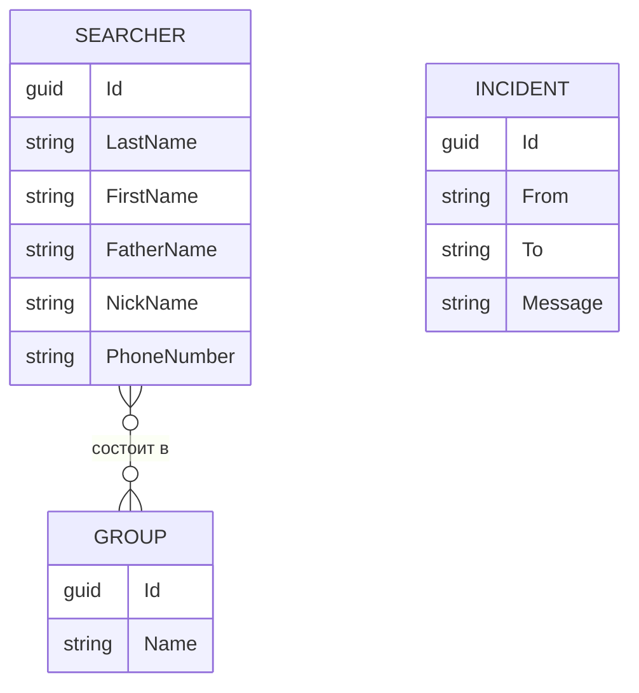

<div align="center">

# 🧭 Opus API

**Backend для приложения «Опус» — цифрового журнала оператора узла связи**

[](https://dotnet.microsoft.com/)
[](https://learn.microsoft.com/dotnet/csharp/)
[](https://learn.microsoft.com/ef/core/)
[](https://learn.microsoft.com/aspnet/core/signalr/)
[](https://swagger.io/)

</div>

---

## 📖 О проекте

**Опус** — приложение для **операторов узла связи** поисково-спасательного отряда
[**ЛизаАлерт**](https://lizaalert.org/).

Во время поисковых работ оператор узла связи (ОУС) принимает и передаёт сообщения,
координирует выходы поисковых групп и ведёт **журнал связи** — хронологию всех
переговоров и событий на поиске. Делать это вручную долго и легко ошибиться, особенно
когда эфир плотный.

**Opus API** — это серверная часть, которая берёт на себя рутину и ускоряет ведение
журнала: хранит данные о поисковиках и группах, фиксирует входящие/исходящие сообщения
и в реальном времени синхронизирует журнал между всеми операторами на одном поиске.

> 🎯 **Цель** — повысить продуктивность ОУС и сократить время на ведение журнала,
> чтобы оператор тратил внимание на поиск, а не на бумажную работу.

---

## ✨ Возможности

- 👥 **Поисковики (Searchers)** — полный CRUD: ФИО, позывной, телефон.
- 🗂️ **Группы (Groups)** — полный CRUD; объединение поисковиков (связь «многие-ко-многим»).
- 📨 **Журнал сообщений (Incidents)** — полный CRUD: от кого, кому, текст.
- 🧩 **DTO-контракты** — на вход и выход отдельные модели: каждый эндпоинт отвечает
  только за свою сущность (создание группы не создаёт поисковиков), а наружу не утекают
  внутренние навигационные поля EF.
- ⚡ **Реалтайм-синхронизация** — обновление журнала у всех операторов через **SignalR**.
- 🧾 **Валидация на уровне модели** — каждая сущность сама проверяет свои данные.
- 📚 **Интерактивная документация** — Swagger UI с XML-описаниями «из коробки».

---

## 🏗️ Архитектура

```
OpusApi/
├── Controllers/         # REST-эндпоинты (Searcher, Group, Incident, Connection)
├── Dtos/                # Контракты API: Request/Response модели и маппинг
│   ├── SearcherDtos.cs
│   ├── GroupDtos.cs
│   ├── IncidentDtos.cs
│   └── DtoMappingExtensions.cs     # Преобразования DTO ⇄ сущность
├── Repositories/        # Доступ к данным (паттерн Repository)
│   ├── IEntityRepository.cs        # Обобщённый контракт CRUD
│   ├── SearcherRepository.cs
│   ├── GroupRepository.cs
│   └── IncidentRepository.cs
├── DbModels/            # Сущности предметной области
│   ├── IdentityModel.cs            # Базовая модель: Id (GUID v7), CreatedAt, Validate()
│   ├── SearcherEntity.cs
│   ├── GroupEntity.cs
│   ├── IncidentEntity.cs
│   └── ConnectionEntity.cs
├── Extensions/          # Авторегистрация репозиториев в DI (assembly scanning)
├── NotificationsHub.cs  # SignalR-хаб для реалтайм-уведомлений
├── SqliteDbContext.cs   # Постоянное хранилище (SQLite)
├── InMemoryDbContext.cs # In-memory хранилище для SignalR-подключений
└── Program.cs           # Точка входа и конфигурация приложения
```

### Ключевые решения

| Решение | Зачем |
|---|---|
| **DTO на вход и выход** | `Request`-модели принимают только собственные поля сущности (изоляция ответственности), `Response`-модели не отдают навигацию EF и не порождают циклы сериализации. Маппинг — в `DtoMappingExtensions`. |
| **Repository + `IEntityRepository<T>`** | Единый CRUD-контракт для всех сущностей; контроллеры зависят от интерфейса, а не от конкретных классов — легко мокать в тестах. |
| **Автоматическая регистрация в DI** | `AddEntityRepositories()` сканирует сборку и сам подключает все реализации `IEntityRepository<T>` — новый репозиторий не нужно прописывать руками. |
| **GUID v7 в качестве Id** | Сортируемые по времени идентификаторы — дружелюбны к индексам БД. |
| **Два DbContext** | SQLite — для доменных данных, InMemory — для эфемерных SignalR-подключений. |
| **Валидация в модели** | Метод `Validate(out string?)` держит правила рядом с данными; контроллеры переиспользуют его после маппинга DTO → сущность. |

---

## 🚀 Быстрый старт

### Требования

- [.NET SDK 10.0+](https://dotnet.microsoft.com/download)

### Запуск

```bash
# Клонировать репозиторий
git clone <repo-url>
cd OpusApi

# Восстановить зависимости и запустить
dotnet run --project OpusApi
```

Приложение поднимется на:

| Профиль | URL |
|---|---|
| HTTP  | `http://localhost:5261` |
| HTTPS | `https://localhost:7180` |

База данных SQLite (`database.sqlite`) создаётся автоматически при первом запуске.

### Документация API

После запуска откройте **Swagger UI**:

```
http://localhost:5261/swagger
```

---

## 🔌 Эндпоинты

### Searchers — поисковики

| Метод | Путь | Описание |
|---|---|---|
| `GET` | `/Searcher` | Список всех поисковиков (`204`, если пусто) |
| `GET` | `/Searcher/{id:guid}` | Поисковик по идентификатору (`404`, если не найден) |
| `POST` | `/Searcher` | Создать поисковика (`400` при ошибке валидации) |
| `PUT` | `/Searcher/{id:guid}` | Обновить поисковика |
| `DELETE` | `/Searcher/{id:guid}` | Удалить поисковика |

### Groups — группы

| Метод | Путь | Описание |
|---|---|---|
| `GET` | `/Group` | Список всех групп с поисковиками (`204`, если пусто) |
| `GET` | `/Group/{id:guid}` | Группа по идентификатору (`404`, если не найдена) |
| `POST` | `/Group` | Создать группу (`400` при ошибке валидации) |
| `PUT` | `/Group/{id:guid}` | Обновить группу |
| `DELETE` | `/Group/{id:guid}` | Удалить группу |

### Incidents — журнал связи

| Метод | Путь | Описание |
|---|---|---|
| `GET` | `/Incident` | Все записи журнала по времени (`204`, если пусто) |
| `GET` | `/Incident/{id:guid}` | Запись по идентификатору (`404`, если не найдена) |
| `POST` | `/Incident` | Добавить запись (`400` при ошибке валидации) |
| `PUT` | `/Incident/{id:guid}` | Обновить запись |
| `DELETE` | `/Incident/{id:guid}` | Удалить запись |

### Connection — активные подключения

| Метод | Путь | Описание |
|---|---|---|
| `GET` | `/Connection` | Список активных SignalR-подключений |

### Realtime — SignalR

| Хаб | Путь | Методы |
|---|---|---|
| Notifications | `/notifications` | `JoinHub(name)` — присоединиться к сессии под именем |

---

## 🧱 Модель данных



Все сущности наследуют `IdentityModel` (`Id`, `CreatedAt`, `Validate()`).

---

## 🛠️ Технологии

- **ASP.NET Core 10** — веб-фреймворк и REST API
- **Entity Framework Core 10** — ORM (SQLite + InMemory провайдеры)
- **SignalR** — двусторонняя связь в реальном времени
- **Swashbuckle / OpenAPI** — автогенерация документации

---

## 🤝 Об отряде

ЛизаАлерт — добровольческий поисково-спасательный отряд. **Оператор узла связи** —
одно из направлений отряда: эти добровольцы обеспечивают связь и координацию на поиске.
Этот проект сделан, чтобы их работа была быстрее и точнее.

> 🔎 Узнать больше об отряде и стать добровольцем: [lizaalert.org](https://lizaalert.org/)
